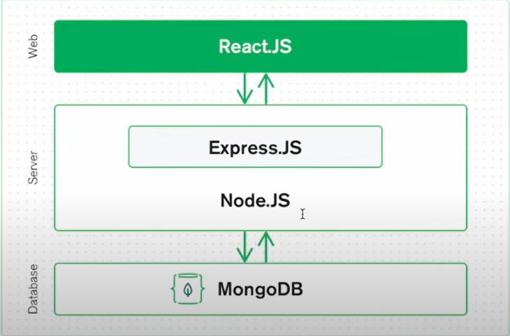
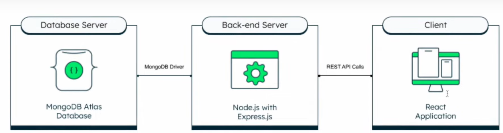

# lecture 4 mongo-DB tutorial

## DataBase
1. Web development = client + server + database
2. Ultimately, Let's suppose we are going to open Restuarant and there is lots
Of data around it,
  1. Number of chefs
  2. Each Person's Detail ( like chef, owner, manager, waiter )
        1. Name
        2. Age
        3. Work
        4. Mobile number
        5. Email
        6. Address
        7. salary
   3. Menu Details ( like, drinks, Snacks, main course )
        1. Name of dish
        2. price
        3. Taste ( like, sweet, sour, spicy )
        4. ls_drink ( boolean true, false )
        5. Ingredients ( array of data) — [ "wheat", "rice", "sugar"] I
        6.  Number of sales ( like 76 )
3. This is an Data we moust have to store to run a fully restaurant
4. so have to With data
5. NOW lots Of Database Out there in market ,we can use accorfding to our need 
    1. sql
    2. postgressSQL
    3. MongoDB
    4. Maria DB
    5. Oracle
6. Databases typically have their own server Systems to manage and provide:
acwss to the data they store.
7. These database server systems are separate from Nodejs servers but work to create dynamic and data-driven web applications

## Nodejs server vs Database server 
1. A database server is a computer program or system that manages databases. It stores. and manages data efficiently
2. The database server stores your data. When your Node.js Server needs data. it sends requests to the database server, which then retrieves and sends the requested data back to the Node.js server. 
3. Node.js server is responsible for handling HTTP requests from clients (like
web browsers) and retuming responses.
4. it prosses these requests, communicates with the database server, and
sends data to clients.
5. 
6. 

## setup mongoDB
1.  https://www.geeksforgeeks.org/how-to-install-mongodb-on-windows/
2. https://www.youtube.com/watch?v=uo3VHw8v_GE

## sql vs no sql

## command 
  0. to start write mongosh
  1. https://blog.e-zest.com/basic-commands-for-mongodb

## i have learn about postman too

## • Connect MongoDB with NodeJS
1.  Now, To connect MongoDB with NodeJS we need a MongoDB driver (a set
of programs)
2.  A MongoDB driver is essential when connecting Node.js with MongoDB
because it acts as a bridge between your Node.js application and the
MongoDB database.
3.  MongoDB speaks its own language (protocol) to interact with the database
server.
4. Node.js communicates in JavaScript.
5. The driver translates the JavaScript code from Node.js into a format that
MongoDB can understand and vice versa.
6. The driver provides a set of functions and methods that make it easier to
perform common database operations from your Node.js code.
7. The driver helps you handle errors that might occur during database
interactions. 
8. It provides error codes, descriptions, and other details to help you troubleshoot issues.
9. • The most popular driver is also known
as the mongodb package.
  1. npm install mongodb
  2. but we dont use it we use mongoose
  3. because it has more functionality

## mongodb vs mongoose driver dont confuse with mongodb its we are just  talking about there driver which are going too be install in vs code\
1. mongoose is an odm library
• Mongoose is like a translator between your Node.js code and MongoDB. It
makes working with the database smoother and easier.
• With Mongoose, you can define how your data should look, like making a
blueprint for your documents. It's like saying, "In our database, each
person's information will havt a name, age, and email." This makes sure
your data stays organized.
• Mongoose helps you make sure the data you put into the database is
correct. It's like having someone check if you've written your email address
correctly before sending a message.
• Very easy to query from the database
—> But if you are using mongodb Native Driver
• You need to write a lot Of detailed instructions to make sure everything
works correctly.
• Without Mongoose, your code might get messy and harder to understand.
• Since you need to handle many details yourself, it can take longer to finish
your project. 
