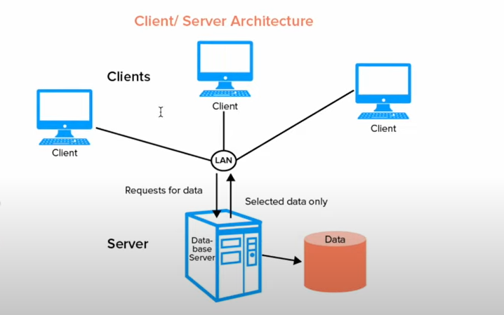
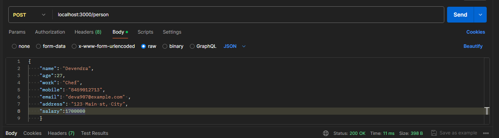
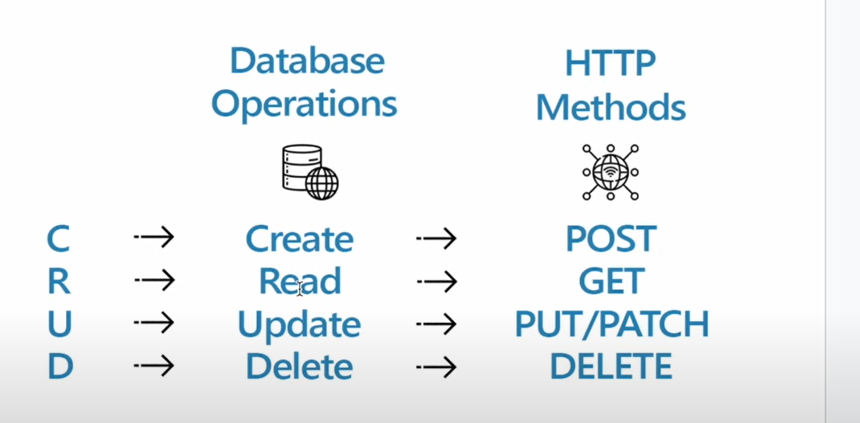

##  Database Connection
1. Connect MongoDB with NodeJS
2. create afile db.js in the root folder
3. The db . js file you've created is essentially responsible for establishing a
connection between your Node.js application and your MongoDB database
using the Mongoose library.
4. In the Last Lecture, we saw that the mongoose is responsible for
connection
5. So let's import Mongoose Library 

## connection step by step
1. **Import Mongoose and Define the MongoDB URL:** In the db . js file, you
first import the Mongoose library and define the URL to your MongoDB
database. This URL typically follows the format
mongodb : / /<hostname> : <port>/<databaseName>.
   1. In your code, you've set the URL to 'mongodb : // localhost : 27017/mydatabase ' ,
   2. where mydatabase is the name of your MongoDB database.

2. **Set Up the MongoDB Connection:** 
    1.  Next, you call mongoose.connect( )
    2. to establish a connection to the MongoDB database using the URL and some configuration options (useNewUrlParser, useUnifiedTopology,etc.). This step initializes the connection process but does not actually connect at this point.

3. **Access the Default Connection Object:** 
    1. Mongoose maintains a default connection object representing the MongoDB connection.
    2.  You retrieve this object using mongoose.connection, and you've stored it in the variable db. This object is what you'll use to handle events and interact with the database.
4. **Define Event Listeners:** 
    1. You define event listeners for the database connection using methods like . on('connected'...)  ,on.('error',...) and .on('disconnected',... ).
    2.  These event listeners allow you to react to different states of the database connection.

5. **Start Listening for Events**: 
    1. The code is set up to listen for events. 
    2. When you call mongoose.connect ( ) , Mongoose starts the connection process.
    3. If the connection is successful, the ' connected ' event is triggered, and
    4. you log a message indicating that you're connected to MongoDB. 
    5. If there's an error during the connection process, then error event is triggered,
    6. and you log an error message. Similarly, the ' disconnected' event can be useful for handling situations where the connection is lost.

6. **Export the Database Connection:**
     1. Finally, you export the db object, which represents the MongoDB connection, so that you can import and use it in other parts of your Node.js application.

7. summary
    1. TO sum it up, the db. j s file acts as a central module that manages the connection to your MongoDB database using Mongoose. It sets up the connection, handles connection events, and exports the connection object SQ that vour Express.is server (or other parts of your application) can use it to interact with t!i.e database. 
    2. When your server runs, it typically requires or imports this db. js file to establish the database connection before handling HTTP requests.

##  What are models or schema?
 1. Models are like a blueprint of our database
 2. It's a representation of a specific collection in MongoDB. Like a Person 
 3. Once you have defined a model, you can create, read, update, and delete documents in the corresponding MongoDB collection.
 3. Mongoose allows you to define a schema for your documents. A schema is like a blueprint that defines the structure and data types of your  documents within a collection.
 4. Each Person's Detail ( like chef, owner, manager, waiter )
 5. ```json 
    {
    "name": "Alice",
    "age":28,
    "work": "Chef",
    "mobile": "123-456-7890",
    "email": "alice@example.com" ,
    "address": "123 Main st, City",
    "salary":6000
    }

    ````
6. make folder name model and file name person
    ```js
    // in person .js 
    //schema for above type of data
    const mongoose = require('mongoose')

        // define the persons schema

        const personSchema = new mongoose.Schema(
            {
                name:{
                    type:String,
                    required: true
                },
                age:{
                    type:Number
                },
                work:{
                    type:String,
                    enum:['chef','waiter','manager'],
                    required:true
                },
                email:{
                    type: String,
                    required:true,
                    unique:true
                },
                address:{
                    type:String,
                    required: true

                },
                salary :{
                    type:String,
                    required:true
                }

            }
        )

        // create a person model 

        const Person =mongoose.model('person',personSchema);

        module.exports=Person


    ```
7. for more read mongoose document

## Body-prser
  1. bodyParser is a **middleware library for Express.js.**
  2.  It is used to parse and extract the body of incoming HTTP requests.
  3. When a client (e.g., a web browser or a mobile app) sends data to a server, it typically includes that data in the body of an HTTP request.
  4. This data can be in various formats, such as JSON, form data, or URL-encoded data.
  5. bodyparser helps parse and extract this data from the request so that you can work with it in your Express.js application.
  6. bodyParser processes the request body before it reaches your route handlers, making the parsed data available in the req. body for further processing.
  7. bodyParser . j son() automatically parses the JSON data from the request body and converts it into a JavaScript object, which is then stored in the req . body
  8. Express.js uses lots of middleware and to use middleware we use the app.use()
  9. npm i body-parser
  10. add code in server.js
        ```js
        const bodyParser =require('body-parser')
        app.use(bodyParser.json())//req.body

        ```
## sent Data from client to server
1. we need an end point where client sents data and data needs to be saved in the database
2. 
3. we need a method called POST 
4. Now code the POST method to add the person
5. If we send the random values as well Mongoose will not save random values other than predefined schema
6. code for post methode
    ```js
    //in server.js

    app.post('/person',(req,res)=>{
    const data =req.body //assuming the request body contains the person data

    //create a new person doccument using a mongoose model 

    const newPerson = new Person(data);

    newPerson.save((error,savedPerson)=>{
        if(error){
            console.log('error saving person : ',error);
            res.status(500).json({error:'internal server error'})
        }
    })
    
    })


    ```
    7. but bad new s is that we donot use this post methode now with call back function 

    8. we use assync awaits

## Assync awaits and isuue with callback 
1. Nowadays no one uses callback functions like, we used in the POST
methods They look quite complex and also do not give us code readability.
2.  What actually callback does, callback is a function that is executed just after
the execution of another main function, it means the callback will wait until
its main function is not executed
3. Async and await are features in JavaScript that make it easier to work with asynchronous code, such as network requests, file system operations, or
database queries.
4. Using try and catch block
5. The try block contains the code for creating a new Person document and
saving it to the database using await newPerson.save()
7. If an error occurs during any step, it is caught in the catch block, and an
error response is sent with a 500 Internal Server Error status.
8.  code
    ```js
    //server .js to get data
    app.post("/person", async (req, res) => {
  try {
    const data = req.body; //assuming the request body contains the person data

    //create a new person doccument using a mongoose model

    const newPerson = new Person(data);

    // save the new person to database
    const response = await newPerson.save();
    console.log("data saved");
    res.status(200).json(response);
     }catch(err){
        console.log(err);
        res.status(500).json({error:'internal server error'})
     }
    });

    ```

    9. then go to postman 
        1. 

## trying get methode too so that we can recieve the data just for practise

```js
app.get('/person' ,async (req,res)=>{
    try{
        const data =await Person.find();
        console.log("deta fetch")
        res.status(200).json(data)
    }catch(error){
        console.log(err);
        res.status(500).json({error:'internal server error'})
    }
})
```

## CRUD operation 
1. 